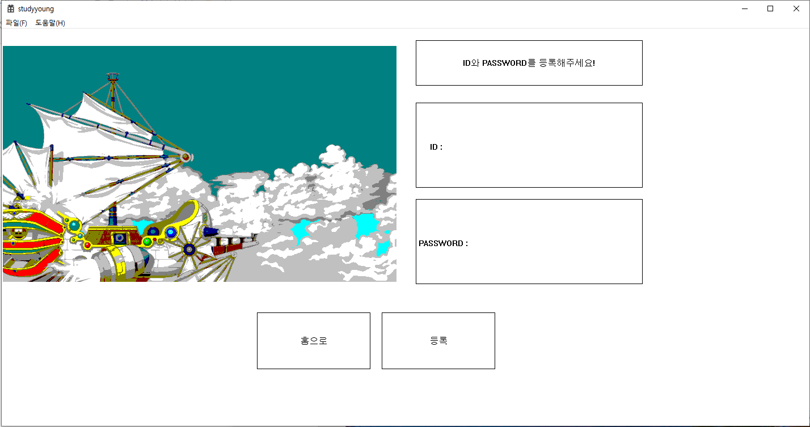
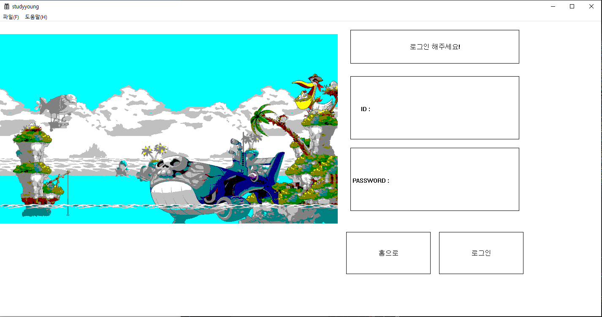
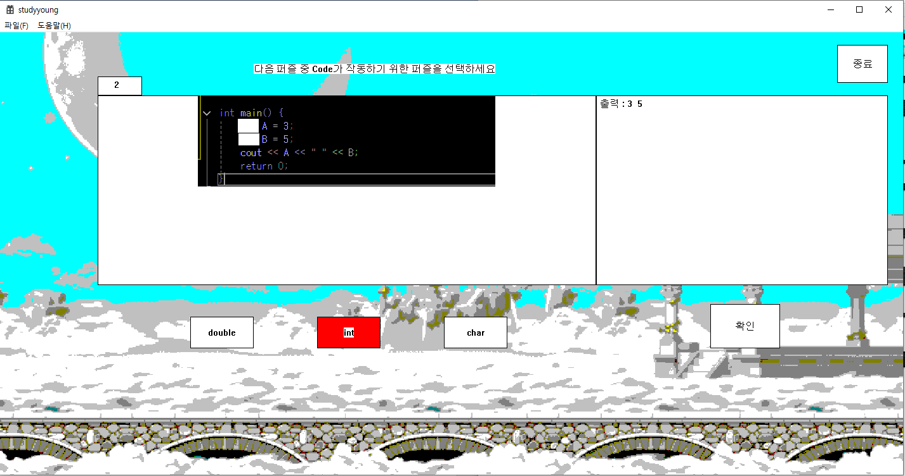
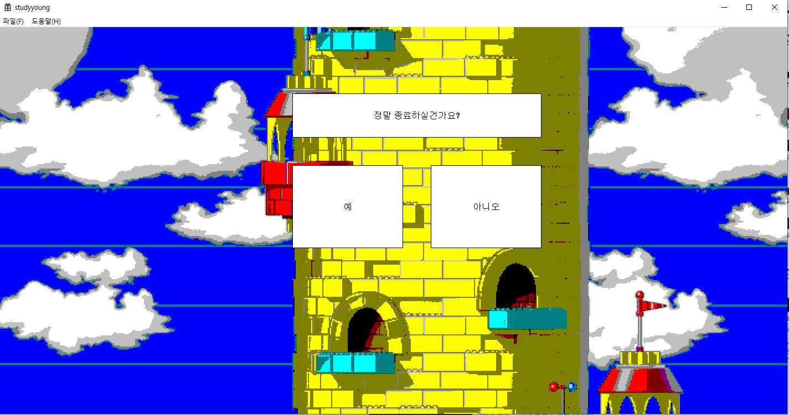
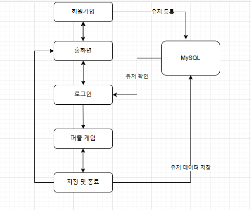

### 1. 팀원

**프로젝트명**: 초중등학생을 위한 교육용 프로그래밍 모듈

**기간**: 2024.09 – 2024.11 (3개월)

**개발자**: 조홍래 **(FullStack)**(1인 총괄)

**GitHub: https://github.com/louis2487**

### 2. 프로젝트 개요

**소개**

 초중등학생들이 C프로그래밍을 흥미로운 방식으로 학습할 수 있는 교육용 모듈입니다. 빈칸이 뚫린 코드와 입출력 구조가 어떻게 작동하는 지 확인하고 올바른 퍼즐 조각을 선택하여 문제를 해결합니다. 입출력, 변수 선언, 연산자와 조건문, 반복문, 배열의 사용까지 기초 프로그래밍 수준의 41문제를 제공합니다. MySQL과 연동하여, 유저 등록과 로그인, 저장 기능을 제공합니다,

**개발 동기**

 지식산업시대에서 AI시대로 변화하는 시대적 흐름에서, 8세~16세 아이들을 대상으로 하는 기초프로그래밍 교육이 필요하다 생각하였습니다. 아이들의 흥미를 유발하기 위해 코드에 일부분을 비워놓고, 아래에 여러 퍼즐조각 중 올바른 퍼즐을 고르는 과정에서 논리적 사고력 향상과 학습 효율성 증대 효과가 있을 것으로 기대하였습니다.
 
**사용 기술**

- **Frontend**: Window API C++
- **Backend**: MySQL

### 3. 전체 흐름

- **Step -1. 회원가입**
    
    

- **Step 0. 홈**
    
    

- **Step 1. 로그인**
    
    
    

- **Step 2. 게임**
    
    
    

- **Step 3. 저장 및 종료**
    
    

    
- **전체 시스템 다이어그램**

    

### 4. 구조 설계

 UserDB 클래스 : 사용자마다 id, 이름, 비밀번호, 문제 단계 등의 정보를 저장하고, 삽입 및 업데이트용 SQL 쿼리를 객체 내부에서 동적으로 생성

 UI 전환: 기능별 Change_Interface 함수를 통해 전역 상태 Interface를 조작하며 화면 흐름을 제어합니다.

 유저 인증: Check_User()로 사용자 정보를 확인하고, 로그인 성공 시 users 배열에 상태를 반영합니다.

 퀴즈 진행: Puzzle_Check()은 버튼 입력을 기준으로 정답을 판별하고, 정답 시 진행도를 증가시켜 다음 문제로 이동합니다

 문자 입력 처리: Write_Str()과 Eraser_Char()로 문자열 입력 및 삭제를 관리하며, Clean_Str()로 초기화합니다.

 DB 연동: CoutDB(), CinDB(), UpdateDB()를 통해 MySQL과 연결하여 유저 정보를 불러오고 저장합니다.

 그래픽 출력: Paint_Quiz()와 Make_Quiz() 등으로 텍스트와 이미지를 그리며, 선택 상태에 따라 버튼 색상을 변경합니다.

 유틸리티 함수: 문자열 및 정수 변환 함수와 텍스트 출력 도우미 함수들로 내부 처리의 일관성과 가독성을 높입니다.

 GUI 기반 접근성: 마우스 클릭 중심의 인터랙션으로 초·중등학생도 손쉽게 접근할 수 있도록 설계.

### 5. 문제 해결

**5-1.  초중등학생의 학습 수준에 맞는 난이도 조정**

프로그래밍에 대한 사전 지식이 거의 없는 초등학생부터, 간단한 알고리즘 개념을 접해본 중학생까지 폭넓은 학습 수준을 고려해야 했습니다. 이를 위해 난이도를 크게 3단계로 나누었습니다. 입출력과 산술 및 증감 연산자의 사용(1), 간단한 조건 분기 사용(2), 조건문과 반복문, 배열의 복합적 사용(3)의 구성으로 
순차적으로 41개 유형의 문제를 학습할 수 있도록 하였습니다.

 **5-2.  유저 데이터 저장 및 진도 관리 문제**

 학생 개개인의 진도와 문제풀이 결과를 저장할 필요가 있어, MySQL을 활용한 간단한 유저 등록 및 로그인, 저장 등의 구조를 설계했습니다. 로그인 후에는 학습자의 진행도에 따라 이전에 저장한 단계의 문제부터 학습할 수 있도록 하였습니다.

### 6. Github Source

 **Source 링크 :** https://github.com/louis2487/Programming-Training-Modules

